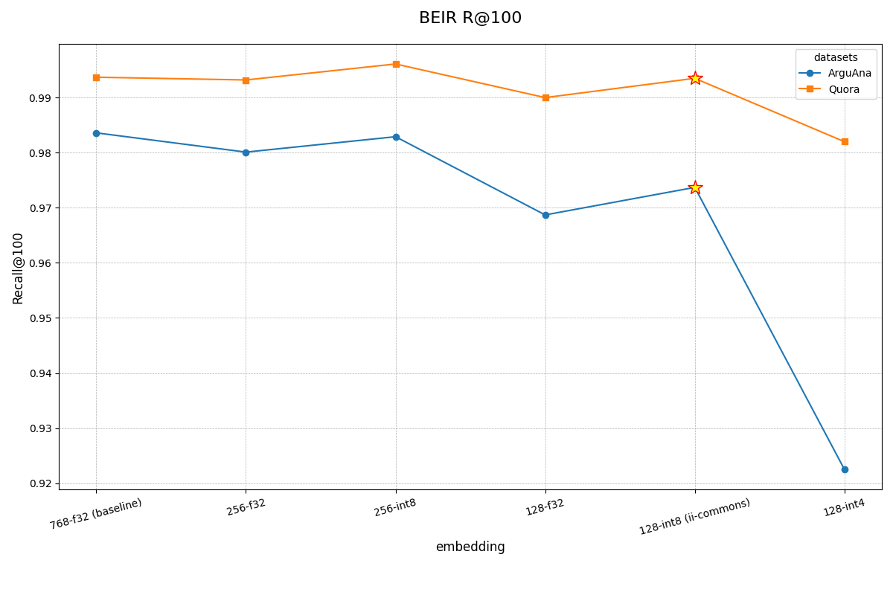

# 预计算嵌入向量数据集说明

我们提供了一系列基于 ArXiv 论文数据的预计算嵌入向量数据集，以方便用户快速启动和测试语义搜索 API。这些数据集包含了论文的元数据和部分内容的文本，以及经过优化的嵌入向量，可以直接下载使用，无需在本地进行耗时的嵌入计算。

## 数据集内容

- **数据来源**: ArXiv 学术论文库。
- **包含内容**:
    - 完整的论文元数据（标题、作者、分类等）。
    - 仅包含具有 Creative Commons (CC) 或公共领域 (Public Domain) 许可证的论文原文内容。
- **内容焦点**: 为了优化在 AI Agent 搜索场景下的效果，我们特别提取并处理了最适合用于检索的三个部分：`abstract`（摘要）、`introduction`（引言）和 `conclusion`（结论）。
- **可用性**:
    - 我们为**所有**论文的 `abstract` 提供了嵌入向量。
    - 我们为**部分**论文的 `introduction` 和 `conclusion` 提供了嵌入向量。

## 嵌入向量处理

为了在存储成本、搜索性能和检索准确度之间取得最佳平衡，我们对嵌入向量进行了以下处理：

1.  **基础模型**: 使用 `Snowflake/snowflake-arctic-embed-m-v2.0` 模型生成原始的 768 维向量。
2.  **维度缩减**: 将 768 维的向量缩减至 128 维。
3.  **量化**: 将 128 维的浮点数向量量化为 `int8` 格式。

这个过程显著减小了数据集的体积，并提升了向量搜索的速度，同时在多数场景下保持了较高的检索精度。

## 性能与精度

我们对维度缩减和量化过程中的精度损失进行了评估。

## 如何使用

您可以参考项目根目录下的 `README.md` 文件中的 "下载数据集" 部分来下载和使用这些数据集。

我们提供了多个数据集，分别对应不同的内容部分，例如：
- `arxiv_abstract_snowflake2_128_int8`: 包含所有论文摘要的嵌入。
- `arxiv_abstract_introduction_snowflake2_128_int8`: 包含部分论文引言的嵌入。

要使用这些数据集，请在您的 `api_server_config.yaml` 文件中配置相应的 `repo_id` 和 `name`，然后运行 `download_hf_duckdb.py` 脚本。
